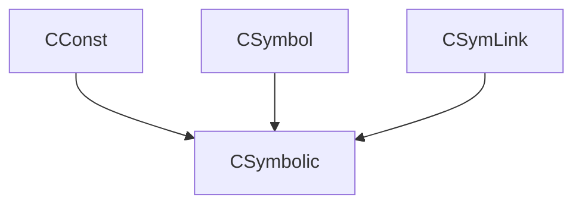

<html lang="en">
   <head>
	 
    </head>
	 
<body>
 <pre><code class="language-mermaid">graph LR
A--&gt;B
</code></pre>

graph LR
A--&gt;B

	
</body>

</html>

# Using Cereal library for serializing objects in C++

Hi there, I just wanted to share my simple CMake example of how to use `Cereal` to serialize classes considering inheritances and polymorphism.
Long story short, we have 3 classes inherited from the base-class as shown below. 
We are also using `STL smart pointers` meaning that `Cereal` should be able to detect the type of the pointee that a base-class pointer points to. As it turns out it is quite simple to define the structure of our inheritance and help `Cereal` understand it.
[Here is a link to my Github repository.](https://github.com/salehjg/Cereal-Cpp-Examples/blob/main/readme.md)

